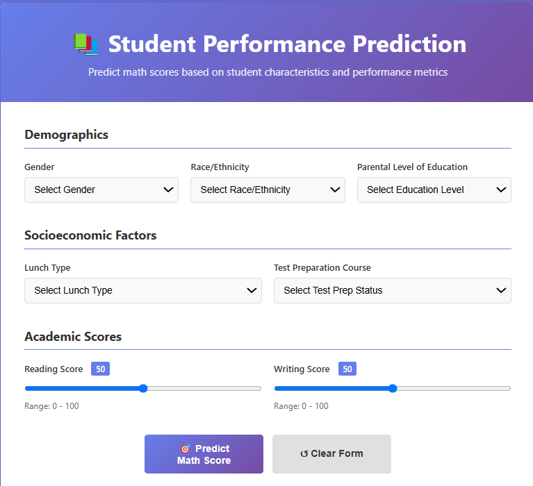

# Student Performance Indicator (ML Project)

This project trains a machine learning model to predict **math score** from student information.  
It also provides a **Flask API** endpoint to get predictions.


---

# How to Run the Project

## 1) Clone the repository


git clone https://github.com/mohamedyehiaaa4/student_performance_indicator.git
cd student_performance_indicator

## 2) Create and activate virtual environment

```bash
python -m venv .venv
```

### Windows

```bash
.venv\Scripts\activate
```

### Linux / Mac

```bash
source .venv/bin/activate
```

---

## 3) Install requirements

```bash
pip install -r requirements.txt
```

## 4) Make sure the dataset exists

The training code reads this file:

```
notebooks/StudentsPerformance.csv
```


## 5) Run the Flask app

```bash
python app.py
```

The server runs with:

host="0.0.0.0", debug=True


# Project Structure (Uses Pipelines)

## Top-level folders

### `artifacts/`

Saved outputs from training:

* CSV files
* `model.pkl`
* `preprocessor.pkl`

### `notebooks/`

Contains dataset:

```
StudentsPerformance.csv
```

### `src/`

Main Python source code.

### `templates/`

HTML pages used by Flask routes.

---


1. **Data Ingestion**

   * Reads CSV
   * Splits train/test
   * Saves files to `artifacts/`

2. **Data Transformation**

   * Creates preprocessing pipeline
   * Handles missing values
   * Scaling
   * One-hot encoding
   * Saves `preprocessor.pkl`

3. **Model Trainer**

   * Trains multiple regression models
   * Selects best model
   * Saves `model.pkl`

The training pipeline is implemented by calling these components sequentially.

---

## 2) Prediction Flow (Pipeline Module)

Prediction is handled by:

```
src/pipeline/predict_pipeline.py
```

### Contains:

* **CustomData**

  * Creates input data in correct format.

* **PredictPipeline.predict()**

  * Loads `preprocessor.pkl`
  * Loads `model.pkl`
  * Transforms input
  * Returns prediction.

---

# Flask Application

`app.py` connects the API to the prediction pipeline.

Routes:

* `GET /` → shows `index.html`
* `GET /predict` → shows `home.html`
* `POST /predict` → gets input and returns prediction
